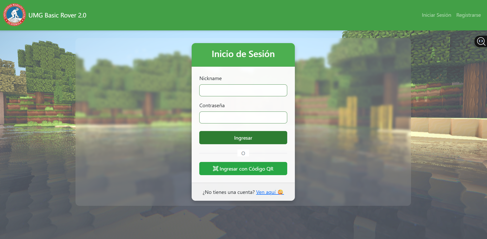
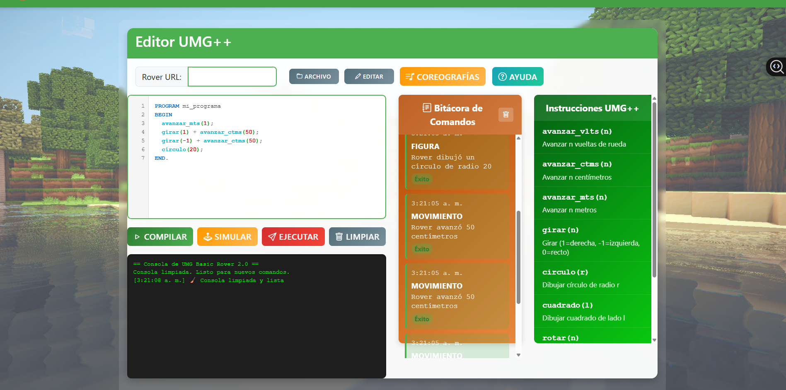
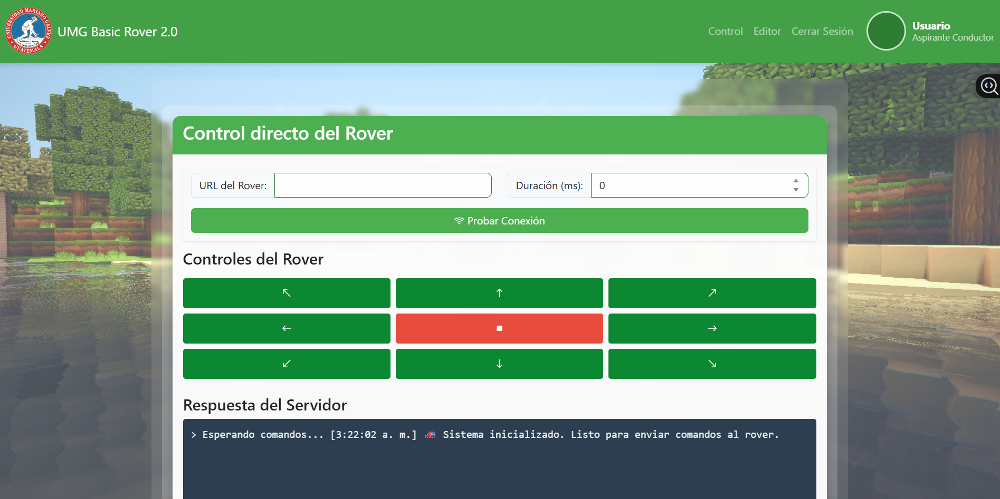
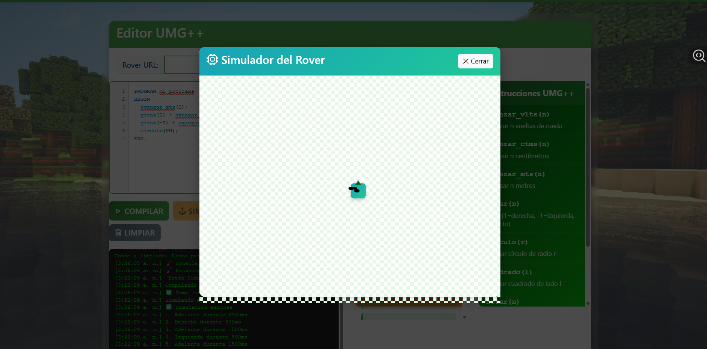

# UMG++ Rover Control Language

Lenguaje de programación propio (**UMG++**) para controlar un rover físico (carro/robot) mediante comandos de movimiento y secuencias coreografiadas.  
Incluye un **analizador léxico, sintáctico y semántico**, un **intérprete/transpilador** y una **plataforma web** que envía instrucciones por **HTTP** a un **ESP8266**, expuesto a Internet mediante **ngrok**.

---

## 🚀 ¿Qué hace este proyecto?

- Permite escribir programas en archivos `.umgpp`
- Compila e interpreta instrucciones como:
  - Avanzar, retroceder, girar
  - Repeticiones y secuencias
  - Coreografías predefinidas
- Simula la trayectoria del rover
- Envía comandos en tiempo real a un **rover físico**
- Controla motores a través de un **ESP8266**
- Comunicación remota por **HTTP + ngrok**
- Registra errores y bitácoras de ejecución
- Incluye una interfaz web con editor de código

---

## 🤖 Rover Físico (Hardware)

Este proyecto no es solo simulación:  
el lenguaje **UMG++** controla un **rover real** conectado por WiFi y accesible desde Internet mediante **ngrok**.

**Componentes principales:**
- ESP8266 (NodeMCU)
- Driver de motores (L298N / L293D o similar)
- Motores DC
- Chasis de rover
- Fuente de energía (batería)

**Flujo de control:**

---

## 🌐 Conectividad Remota (HTTP + ngrok)

Para permitir el control del rover desde cualquier red:

- El ESP8266 expone un endpoint HTTP (ej. `/move`)
- Se crea un túnel público usando **ngrok**
- El backend envía comandos HTTP al endpoint de ngrok
- ngrok reenvía la petición al ESP8266 en la red local

  
| Tecnología                          | Uso                               |
| ----------------------------------- | --------------------------------- |
| JavaScript / Node.js                | Backend del compilador            |
| HTML / CSS / JS                     | Interfaz web                      |
| MySQL                               | Usuarios y bitácoras              |
| Jison / JFlex / CUP (o equivalente) | Lexer & Parser                    |
| Express                             | Servidor web                      |
| Canvas / SVG                        | Simulación del rover              |
| ESP8266 (NodeMCU)                   | Control físico del rover          |
| Arduino IDE                         | Firmware del ESP8266              |
| WiFi / HTTP                         | Comunicación                      |
| ngrok                               | Túnel público para control remoto |

## 📷 Capturas de Pantalla

  
  

  
  

